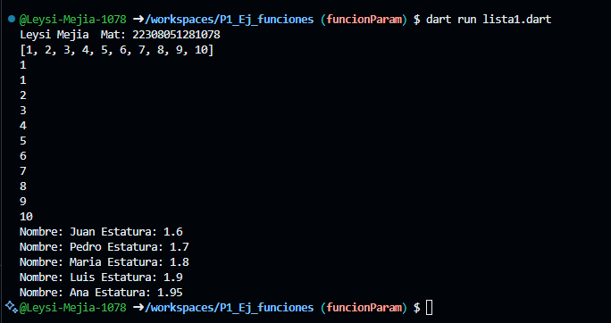
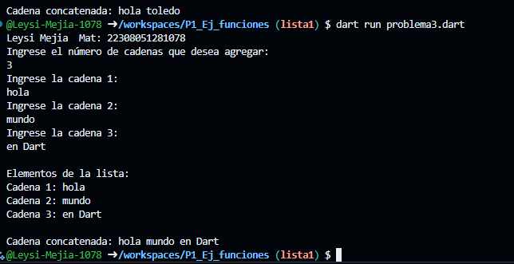

Salida de datos de listas 

Desarrolla un programa que tome una lista de cadenas (string) y las concatene en una sola cadena, separándolas por espacios. que utilice 2 funciones una para capturar datos de la lista y otra para mostrar los elementos
