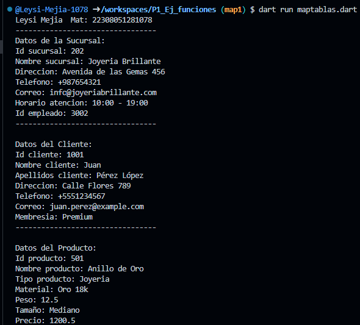

crear map <string, dynamic> sucursal con los siguientes key, id_sucursal, nombre_sucursal, direccion, telefono, correo, horario_atencion,id_empleado. y mostrar los datos con un forech. lenguaje dart

crear map <string, dynamic> cliente con los siguientes key, id_cliente, nombre_cliente, apellidos_cliente, direccion, telefono, correo ,membresia. y mostrar los datos con un forech. lenguaje dart

crear map <string, dynamic> producto con los siguientes key, id_producto, nombre_producto, tipo_producto, material, peso, tamaño, precio. y mostrar los datos con un forech. lenguaje dart

salida de datos 
